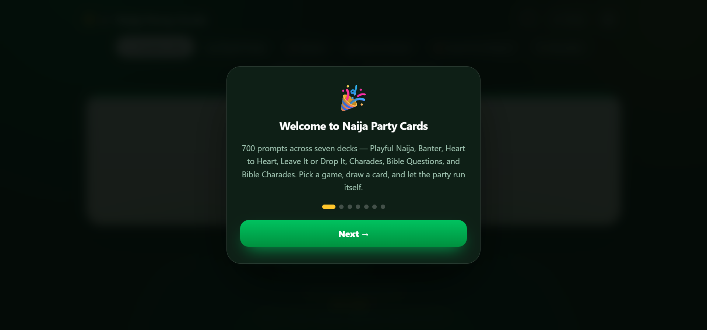
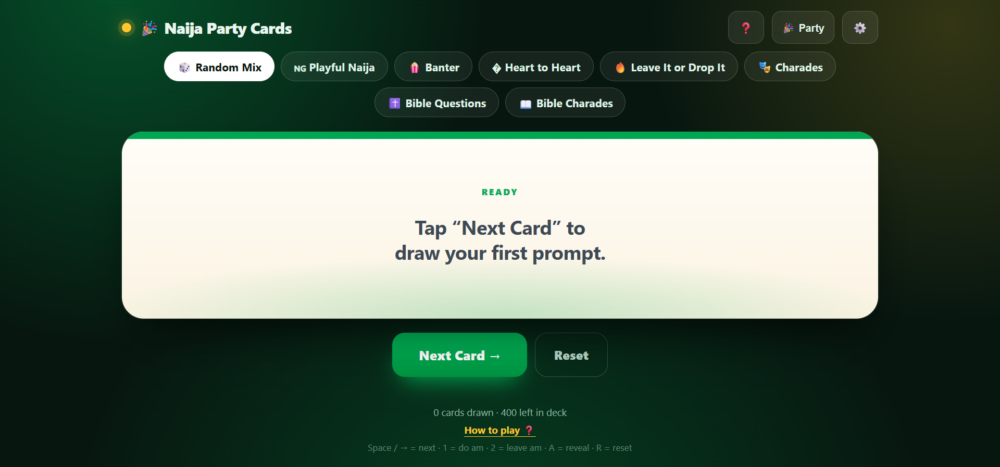
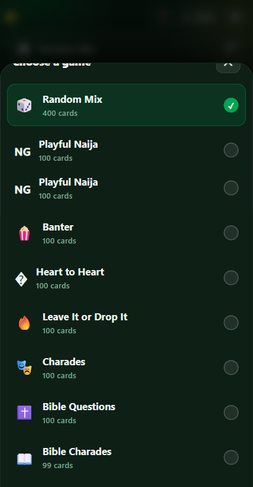
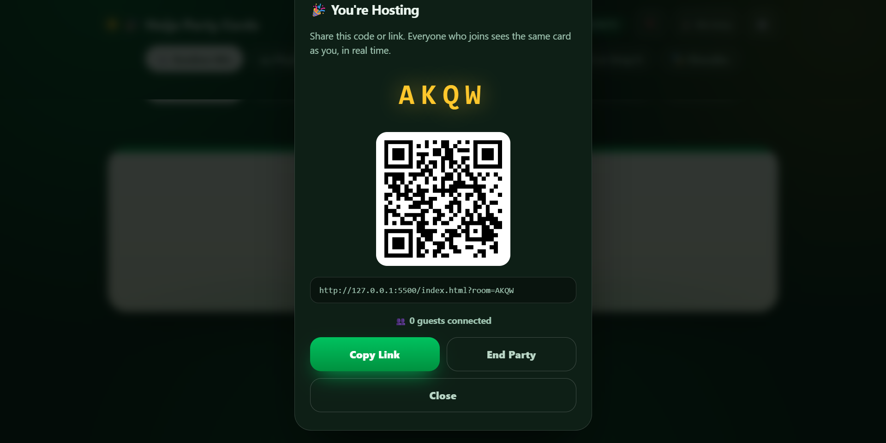
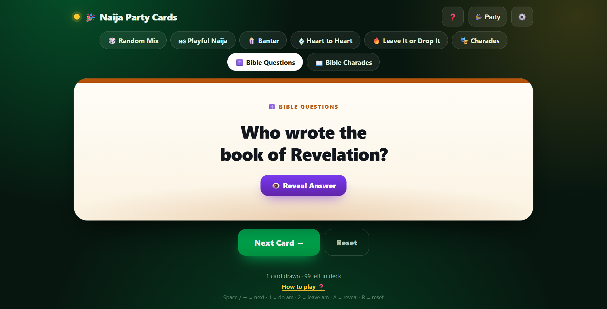
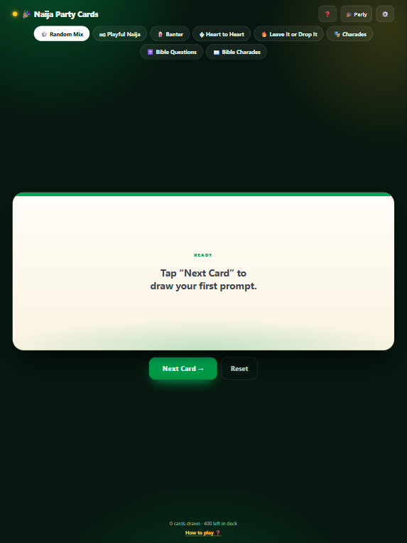

# 🎉 Naija Party Cards

<p align="center">
  
</p>

<p align="center">
  <strong>A single-file, offline-capable party game for Nigerian parties, friends, and family.</strong><br>
  Real-time multi-device sync so everyone at the party sees the same card at the same time.
</p>

<p align="center">
  
</p>

<p align="center">
  <em>Desktop layout with the game chips and an active prompt.</em>
</p>

Built as one HTML file with zero build steps, zero backend, and zero accounts. Drop it on any static host, share the link, and play.

> Looking for the couples version? That lives [here](https://github.com/MmedaraU/couple-games) with its own README.

---

## Table of Contents

- [Features](#features)
- [Screenshots](#screenshots)
- [Quick Start](#quick-start)
- [How to Play](#how-to-play)
- [Game Decks](#game-decks)
- [Random Mix Behaviour](#random-mix-behaviour)
- [Party Mode](#party-mode)
- [Onboarding Guide](#onboarding-guide)
- [Keyboard Shortcuts](#keyboard-shortcuts)
- [Responsive Design](#responsive-design)
- [Deployment](#deployment)
- [Customization](#customization)
- [Technical Architecture](#technical-architecture)
- [Browser Support](#browser-support)
- [Troubleshooting](#troubleshooting)
- [Known Limitations](#known-limitations)
- [Roadmap](#roadmap)
- [License](#license)

---

## Features

- **700 prompts** across seven decks — Playful Naija, Banter, Heart to Heart, Leave It or Drop It, Charades, Bible Questions, and Bible Charades.
- **Real-time Party Mode** — one host, unlimited guests, all devices see the same card simultaneously.
- **Room codes + QR codes** — guests join in seconds by typing a 4-character code, scanning a QR, or opening a shared link.
- **Do Am / Leave Am** — dare and charade cards let players accept or skip, with confetti and sound feedback.
- **Bible trivia with reveal** — questions hide their answers behind a synced Reveal Answer button.
- **Random Mix or targeted decks** — play a shuffle of the four conversational decks, or focus on a single game.
- **Hamburger game selector on mobile** — full-width button opens a bottom sheet for deck selection on phones and portrait tablets.
- **Onboarding guide** — a 7-step tour appears on first open and can be reopened anytime.
- **Birthday personalization** — replace "the birthday celebrant" with the actual name, synced to all devices.
- **Keyboard-first** — full shortcut support for laptops and TVs.
- **Swipe gestures** — draw and skip with a swipe on touch devices.
- **Sound + confetti** — local per device, so each phone reacts on its own.
- **Fully responsive** — tuned for phones, tablets, laptops, TVs, and landscape phones.
- **Zero backend** — pure client-side, deploys anywhere static files are served.
- **Offline solo play** — the whole game works without internet if you skip Party Mode.

---

## Screenshots

### Desktop and mobile

| Desktop                                         | Mobile                                                  |
| ----------------------------------------------- | ------------------------------------------------------- |
|  |  |

<p align="center">
  <em>Left: desktop chips row and full-size card. Right: mobile game selector bar with the bottom sheet closed.</em>
</p>

### Deck selector on mobile

<p align="center">
  
</p>

<p align="center">
  <em>The bottom sheet lists every deck with its emoji, name, and card count. Tap to switch instantly.</em>
</p>

### Party Mode host panel

<p align="center">
  
</p>

<p align="center">
  <em>Share the 4-character code, the link, or the QR. Everyone who joins sees the same card in real time.</em>
</p>

### Bible Questions with reveal

<p align="center">
  
</p>

<p align="center">
  <em>Bible trivia cards hide the answer behind a Reveal Answer button that syncs across all devices.</em>
</p>

---

## Quick Start

### Run locally

1. Download `index.html` (or copy the code into a file with that name).
2. Double-click it to open in any modern browser.
3. Tap **Next Card** to draw.

Solo mode works fully offline over `file://`.

### Run a party

1. Open the file in a browser (or visit the hosted URL) on the **host device**.
2. Tap **🎉 Party → Host a Party**.
3. Share the 4-character code, the link, or the QR code with guests.
4. Guests open the link or tap **🔗 Join a Party** and type the code.
5. Draw cards — every connected device mirrors the same card.

> Party Mode needs internet access for the initial peer connection. Solo mode does not.

---

## How to Play

### Solo / shared-screen play

1. Pick a deck using the chips at the top (desktop) or the game selector bar (mobile).
2. Tap **Next Card**, swipe left on the card, or press **Space / →**.
3. Read the prompt aloud and let the group answer, debate, or vote.
4. For dare or charade cards, tap **💪 I DO AM** or **🙅 I LEAVE AM**.
5. For Bible question cards, tap **👁️ Reveal Answer** when the group is ready.
6. Tap **Reset** (or press **R**) to reshuffle and start over.

### Party Mode play

- The **host** controls the deck: draws cards, switches games, resets, and changes the birthday name.
- **Guests** see the same card, in sync. They can also tap **Do Am / Leave Am** — the host's device receives the choice and advances everyone.
- Guests cannot switch decks or reset the game; those controls are hidden on their devices.
- The host's device must stay open and online for the room to keep working.

---

## Game Decks

<p align="center">
  
</p>

| Deck                | Emoji | Count   | Style                                                      | In Random Mix |
| ------------------- | ----- | ------- | ---------------------------------------------------------- | ------------- |
| Playful Naija       | 🇳🇬     | 100     | Would-you-rather, who-in-this-room, finish-the-sentence    | ✅             |
| **Banter**          | 🍿     | 100     | Group debates, hot takes, playful roast prompts            | ✅             |
| **Heart to Heart**  | 💗     | 100     | Tiered deep questions — Perception, Connection, Reflection | ❌             |
| Leave It or Drop It | 🔥     | 100     | Dares, performances, reveals                               | ✅             |
| Charades            | 🎭     | 100     | Act-it-out prompts — Nigerian life, animals, jobs, movies  | ❌             |
| Bible Questions     | ✝️     | 100     | Trivia with hidden answers, including obscure questions    | ✅             |
| Bible Charades      | 📖     | 100     | Act-it-out Bible stories, parables, and events             | ❌             |
| **Random Mix**      | 🎲     | **400** | The four conversational decks shuffled together            | —             |

### Card behaviour by type

| Type           | Example                                       | Buttons shown            |
| -------------- | --------------------------------------------- | ------------------------ |
| Plain          | Playful Naija, Banter, Heart to Heart         | None                     |
| Dare / Charade | Leave It or Drop It, Charades, Bible Charades | 💪 I DO AM · 🙅 I LEAVE AM |
| Bible Question | Bible Questions                               | 👁️ Reveal Answer          |

---

## Random Mix Behaviour

Random Mix is deliberately curated — it excludes the two charade decks and Heart to Heart so the mix stays focused on lighter conversational, dare, and trivia prompts.

```js
const RANDOM_MIX_EXCLUDE = ["charades", "biblec", "realtalk"];
```

**Included in Random Mix:**
- Playful Naija
- Banter
- Leave It or Drop It
- Bible Questions

**Excluded from Random Mix:**
- Charades
- Bible Charades
- Heart to Heart

All excluded decks are still fully playable via their own chips or the mobile deck sheet. To re-include one, remove its key from the `RANDOM_MIX_EXCLUDE` array.

---

## Party Mode

<p align="center">
  
</p>

Party Mode uses WebRTC (via PeerJS) to connect devices directly. There is no server relaying game data — the host's browser is the source of truth, and guests receive state updates in real time.

### Hosting

- Tap **🎉 Party → Host a Party**.
- A 4-character room code is generated (e.g. `K7QP`).
- The host panel shows:
  - The room code (large, readable aloud)
  - A QR code guests can scan
  - A copyable share link (`?room=K7QP`)
  - A live guest count
- Actions the host takes are broadcast to every connected guest.
- Tap **End Party** to close all connections and return to solo mode.

### Joining

- Open the shared link (auto-joins), or
- Tap **🎉 Party → Join a Party** and type the 4-character code.
- Once connected, the guest's screen locks to the host's state.

### What syncs

- Current card
- Deck tag and accent colour
- Drawn / done / skipped counters
- Remaining cards in the deck
- Selected game mode (filter)
- Birthday name
- Bible answer reveal state

### What does *not* sync

- Sound effects (each device plays its own)
- Confetti (each device animates its own)
- Local settings (name field, sound toggle — saved per device)

---

## Onboarding Guide

<p align="center">
  
</p>

A 7-step guide appears automatically the first time someone opens the app. It walks through:

1. **Welcome** — what the app is
2. **Choose your game** — the filter chips and the seven decks
3. **Draw a card** — button, swipe, and keyboard
4. **Do Am / Leave Am** — how dares and charades work
5. **Bible Questions & Bible Charades** — the reveal mechanic and the charade format
6. **Party Mode** — host and join with a shared code
7. **Make it personal** — Settings, name, sound, reset

Each slide has an animated emoji, title, body text, dot indicators you can tap, and **Back / Next** buttons. The last slide becomes **Let's Play 🎉** and fires confetti.

**Reopen anytime:**
- Tap the **❓** button in the header.
- Tap the **How to play ❓** link in the footer.

The guide is skipped if someone opens the app via a party link (`?room=CODE`) so they aren't interrupted mid-join. It only auto-appears if the player has never seen it (tracked in `localStorage`).

**Keyboard navigation while the guide is open:**
- **→ / Enter** = next slide
- **←** = back
- **Esc** = close

---

## Keyboard Shortcuts

| Key                     | Action                             |
| ----------------------- | ---------------------------------- |
| `Space` / `→` / `Enter` | Draw next card                     |
| `1`                     | I DO AM (dare or charade cards)    |
| `2`                     | I LEAVE AM (dare or charade cards) |
| `A`                     | Reveal Answer (Bible questions)    |
| `R`                     | Reset the deck                     |

Shortcuts are paused while the onboarding guide is open, while the deck sheet is open, or while typing in an input field.

---

## Responsive Design

<p align="center">
  
</p>

The layout adapts across screen sizes and input methods.

### Desktop and large tablets

- **Chips row** at the top — all seven game modes plus Random Mix, wrap-around layout.
- Full-size card, generous padding, and both footer shortcut hints visible.

### Phones and portrait tablets (≤1024px portrait)

- **Chips row is replaced by a full-width game selector button** with a staggered hamburger icon.
- Tapping the bar opens a **bottom sheet** listing every deck with its emoji, name, card count, and a checkmark on the current selection.
- The sheet closes on backdrop tap, ✕ button, or Escape.
- Guests in Party Mode cannot open the sheet — a "Host controls the game" toast appears.

### Small phones (≤560px)

- Brand text hides, icon buttons shrink.
- **Do Am / Leave Am buttons stack full-width.**
- Next and Reset split 50/50.
- Footer keyboard hints hide.
- Modals collapse to single-column actions.

### Very small phones (≤380px)

- Extra-compact padding, smaller chips, tighter card.

### Landscape phones (≤540px height)

- Compressed vertical layout so the card fits on screen.
- Header and footer hints hide.

### Other responsive touches

| Feature              | Behaviour                                                             |
| -------------------- | --------------------------------------------------------------------- |
| **Notched devices**  | Header and footer respect `env(safe-area-inset-*)`                    |
| **Touch devices**    | Keyboard hints hidden; `touch-action: manipulation` removes tap delay |
| **iOS text scaling** | `text-size-adjust: 100%` prevents unwanted scaling                    |
| **iOS focus zoom**   | Inputs stay at 16px to prevent zoom on focus                          |
| **Reduced motion**   | All animations and transitions disabled                               |
| **Card centering**   | `justify-content: safe center` prevents long cards from being cut off |

---

## Deployment

Because everything lives in a single HTML file, you can host it anywhere static. HTTPS is required for Party Mode (WebRTC).

### GitHub Pages

```bash
git add index.html
git commit -m "Add Naija Party Cards"
git push origin main
```

Then enable GitHub Pages in **Settings → Pages** and select the branch.

### Netlify

- Drag the folder onto [app.netlify.com/drop](https://app.netlify.com/drop), or
- Connect your repo and set the publish directory to the folder containing `index.html`.

### Vercel

```bash
vercel --prod
```

### Cloudflare Pages

- Create a project, point it at your repo, and set the build output directory.

### Any shared hosting

- Upload `index.html` to `public_html` or your web root.
- Ensure HTTPS is enabled (required for Party Mode).

### Running locally for testing

```bash
python3 -m http.server 8080
# or
npx serve .
```

Then visit `http://localhost:8080`.

---

## Customization

All editable content lives in a few clearly-labelled blocks near the top of the `<script>` tag.

### Add or change prompts

Find the `RAW` object. Each deck is an array of strings, or objects with optional `answer` and `kind`:

```js
const RAW = {
  naija: [
    "Your custom question here",
    // ...
  ],
  bibleq: [
    { text: "Who built the ark?", answer: "Noah" },
    // ...
  ],
  biblec: [
    "Act out: Noah building the ark",
    // ...
  ]
};
```

- A plain string becomes a plain card.
- A string in the `charades` or `biblec` deck automatically becomes a charade card (Do Am / Leave Am).
- An object with `answer` becomes a question card with a reveal button.

### Rename a deck or change its colour

Edit the `DECKS` object:

```js
const DECKS = {
  naija:  { label: "Playful Naija",   emoji: "🇳🇬", color: "#00A651" },
  // ...
};
```

The `color` value becomes the accent stripe on the card.

### Change or reorder the game chips

Edit the `FILTERS` array:

```js
const FILTERS = [
  { key: "all",     label: "🎲 Random Mix" },
  { key: "naija",   label: "🇳🇬 Playful Naija" },
  // ...
];
```

Each `key` must match a key in `DECKS`.

### Change which decks appear in Random Mix

Edit the exclusion list:

```js
const RANDOM_MIX_EXCLUDE = ["charades", "biblec", "realtalk"];
```

Remove a key to include that deck in Random Mix, or add another to exclude it.

### Change the room code length

In `makeCode()`:

```js
function makeCode() {
  let out = "";
  for (let i = 0; i < 4; i++) out += CODE_CHARS[Math.floor(Math.random() * CODE_CHARS.length)];
  return out;
}
```

Change `4` to whatever length you want, then update the join input's `maxlength` attribute in `showJoinPanel()` to match.

### Change which characters appear in codes

Edit `CODE_CHARS`. The default excludes `I`, `O`, `0`, and `1` because they're easy to confuse when read aloud.

### Edit onboarding slides

Modify the `INTRO_STEPS` array. Each step has `emoji`, `title`, and `body`.

### Bundling dependencies locally (optional)

By default the page loads two external resources:

- **PeerJS** from `unpkg.com`
- **QR codes** from `api.qrserver.com`

To make the site fully self-contained:

1. Download `peerjs.min.js` and reference it locally.
2. Replace the QR image with a client-side generator like `qrcode.js`.

### Self-hosting the PeerJS signaling server (optional)

For larger or public events, run your own PeerJS server and pass it to the constructor:

```js
peer = new Peer(PEER_PREFIX + roomCode, {
  host: "your-peerjs-host",
  port: 443,
  secure: true
});
```

This removes dependence on the public PeerJS cloud.

---

## Technical Architecture

### Stack

- **HTML + CSS + vanilla JavaScript** — no framework, no bundler, no build step.
- **PeerJS** — WebRTC wrapper for peer discovery and data channels.
- **Canvas 2D** — confetti animation.
- **Web Audio API** — synthesized sounds (no audio files).
- **LocalStorage** — settings persistence.
- **QR Server API** — QR code image for the host panel.

### File structure

```
your-project/
├── index.html                ← everything (markup, styles, logic, decks)
├── README.md                 ← this file
└── assets/
    ├── party-banner.png
    ├── party-desktop.png
    ├── party-mobile.png
    ├── party-deck-sheet.png
    ├── party-host-panel.png
    ├── party-bible-reveal.png
    ├── party-deck-chips.png
    ├── party-mode-diagram.png
    ├── party-onboarding.png
    └── party-responsive.png
```

### State model

The host owns:

- `state.queue` — shuffled pool of remaining cards
- `state.current` — the visible card
- `state.drawn`, `state.didCount`, `state.leaveCount` — counters
- `state.filter` — selected deck
- `partyName` — birthday name
- `revealed` — Bible answer visibility

Guests mirror this via `applyRemoteState()`.

### Sync messages

**Host → guests** (`buildStatePayload`):

```js
{
  type: "state",
  card, drawn, didCount, leaveCount,
  remaining, filter, name, revealed
}
```

**Guest → host**:

```js
{ type: "action", action: "next" | "do" | "leave" }
```

### Lifecycle

1. Host opens a PeerJS connection with ID `naija-party-<CODE>`.
2. Guests connect to that ID.
3. On every host change, `broadcastState()` sends the full payload.
4. On guest actions, the host applies them locally and re-broadcasts.

### Persistence

- `naijaPartyCards.v3` — name + sound preference (per device).
- `naijaPartyCards.introSeen` — whether onboarding has been completed.

Rooms are ephemeral. There is no server-side state.

---

## Browser Support

| Browser                           | Solo | Party Mode |
| --------------------------------- | ---- | ---------- |
| Chrome / Edge (desktop + Android) | ✅    | ✅          |
| Safari (macOS + iOS)              | ✅    | ✅          |
| Firefox                           | ✅    | ✅          |
| Samsung Internet                  | ✅    | ✅          |
| Older browsers without WebRTC     | ✅    | ❌          |

Party Mode requires HTTPS (or `localhost`).

---

## Troubleshooting

**Guests can't connect**
- Make sure the host is still on the page and hasn't refreshed.
- Confirm both devices have internet.
- Check that the site is served over HTTPS.
- Some corporate or public Wi-Fi blocks WebRTC — try a mobile hotspot.
- If the room code collides, the host will auto-generate a new one.

**Room code not found**
- Codes are case-insensitive and use `A–Z` (minus I/O) and `2–9` (minus 0/1).
- Ask the host to re-read the code from their screen.
- The room may have expired if the host closed the tab.

**QR code doesn't load**
- The QR uses an external API. If it's blocked, the copyable link still works.

**Sound doesn't play**
- Browsers block audio until the first user interaction. Tap the screen once, then draw.
- Check the Sound toggle in ⚙️ Settings.

**The guide reappears every time**
- LocalStorage may be disabled (private browsing, strict privacy settings).
- The ❓ button always reopens it manually.

**Cards feel repetitive**
- The queue avoids repeats until it's exhausted, then reshuffles.
- Switching decks rebuilds the queue from scratch.

**The game selector doesn't show on mobile**
- It appears when the viewport is ≤1024px **and** the device is in portrait orientation. Rotate back to portrait if you don't see it.

**Party Mode advanced:**
- Host device must stay awake. Screen-lock may suspend the connection on some phones.
- Guests who refresh will attempt to rejoin automatically if the URL still contains `?room=CODE`.

---

## Known Limitations

- **Host-dependent** — closing the host tab ends the room; there is no server to recover state.
- **No reconnection logic** — dropped guests must rejoin manually.
- **No persistence** — refreshing the host starts a new room.
- **No authentication** — 4-character codes are guessable; suitable for private parties, not sensitive data.
- **No moderation** — any connected guest can trigger Do/Leave actions.
- **Public PeerJS cloud** — subject to rate limits and occasional downtime.
- **Confetti and sound are local** — each device animates and beeps independently.

---

## Roadmap

Ideas for future versions:

- **Persistent rooms** backed by Firebase or Supabase.
- **Reconnection and rejoin** for hosts and guests.
- **Custom deck builder** — add prompts from the UI.
- **Score tracking per player** with a leaderboard.
- **Timer mode** — countdown per card.
- **Team mode** — split the room into two teams.
- **Streamer mode** — large-format display for TVs.
- **Localization** — Yoruba, Igbo, Hausa, and Pidgin UI strings.
- **Self-hosted PeerJS + TURN** for reliability behind strict NATs.
- **PWA install** — offline caching and home-screen launch.

---

## License

Free to use, modify, and share for personal parties and community events.

Prompt content is original and written for this project. If you redistribute, a credit link back is appreciated but not required.

---

## Credits

- Game concept and content: written for Naija Party Cards.
- Sync layer: [PeerJS](https://peerjs.com/) over WebRTC.
- QR generation: [qrserver.com](https://goqr.me/api/).
- Sound effects: synthesized in-browser with the Web Audio API.
- Confetti: custom canvas animation.

<p align="center">
  Enjoy the party. 🎉🇳🇬
</p>